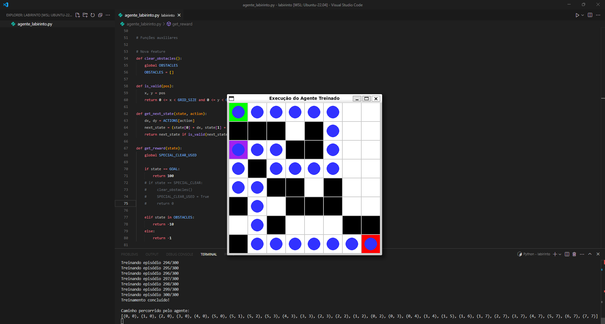
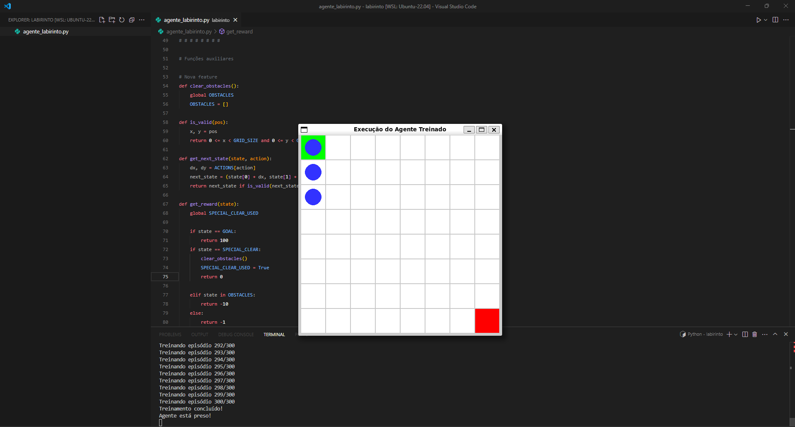
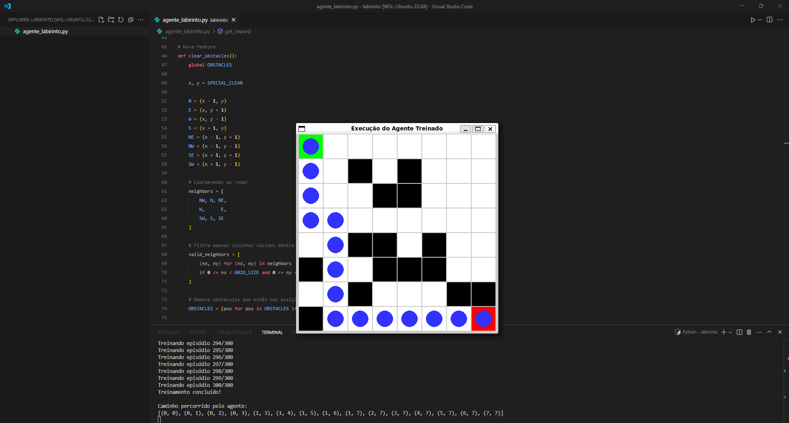

# qLearning

**Este projeto explora o algoritmo Q-Learning aplicado à nevagação de um agente em um labirinto.**

### Tecnologia utilizada:

### Objetivo:

Testar como a combinação das recompensas positivas e negativas afetam o desempenho e a velocidade do aprendizado do agente. Para isso eu devo:

- Implementar uma funcionalidade que altere o comportamento padrão do agente no labirinto.

---

### Configuração base:

- O ambiente é um labirinto 8x8.

- O agente parte de uma posição inicial e deve encontrar a meta (goal).

- Existem obstáculos (blocos pretos) que devem ser evitados.

- A cada ação, o agente recebe uma recompensa:

	- +100 ao alcançar o objetivo.

	- -10 ao colidir com um obstáculo.

	- -1 para cada passo (custo de movimento).

---

### Nova funcionalidade

- Bloco que explode os obstáculos num raio de 1 quadrado.

---

### Experimentos realizados:

1. **Labirinto simples (com obstáculos)**
	
	> O agente foi treinado e conseguiu sair do labirinto dentro do escopo (300).

2. **Labirinto com nova funcionalidade (remove todos os obstáculos)**
	
	> O agente **não** conseguiu sair do labirinto dentro do escopo (300).

3. **Labirinto com nova funcionalidade (remove obstáculos no raio de um quadrado)**
	
	
	> O treinamento foi mais eficiente, pois o agente conseguiu encontrar a saída do labirinto mais rapidamente.

---

### Conclusões:

- As recompensas positivas e negativas são fundamentais para o comportamento esperado do treinamento;
- Pequenas mudanças podem ter grande impacto na eficiência do aprendizado:
	- sem os obstáculos: agente preso no labirinto;
	- explosão de obstáculos: agente encontra a saída mais rapidamente.

---

Para mais informações sobre Q-Learning acesse:
[deep-learning-book](https://www.deeplearningbook.com.br/algoritmo-de-agente-baseado-em-ia-com-reinforcement-learning-q-learning/#:~:text=O%20Q%2Dlearning%20%C3%A9%20um,atual%2C%20como%20executar%20a%C3%A7%C3%B5es%20aleat%C3%B3rias.)
